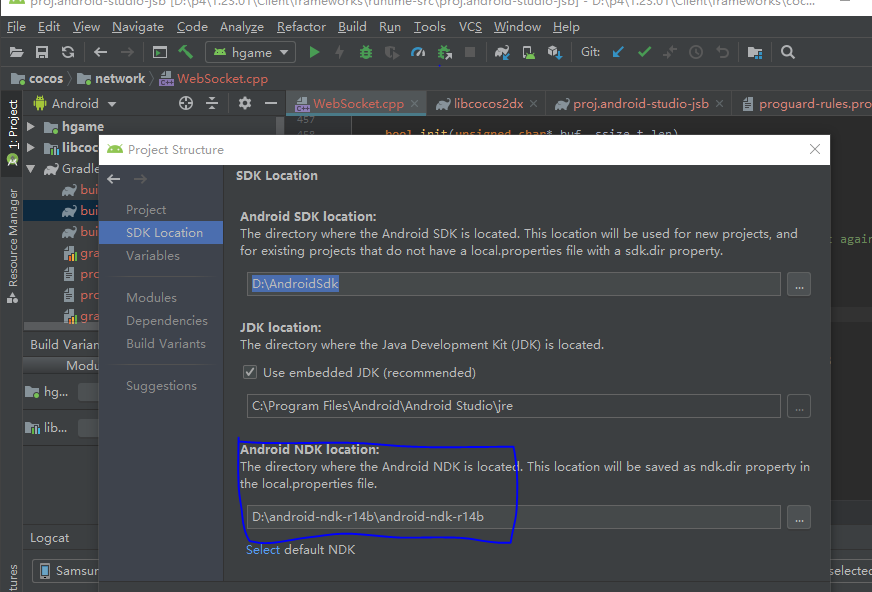
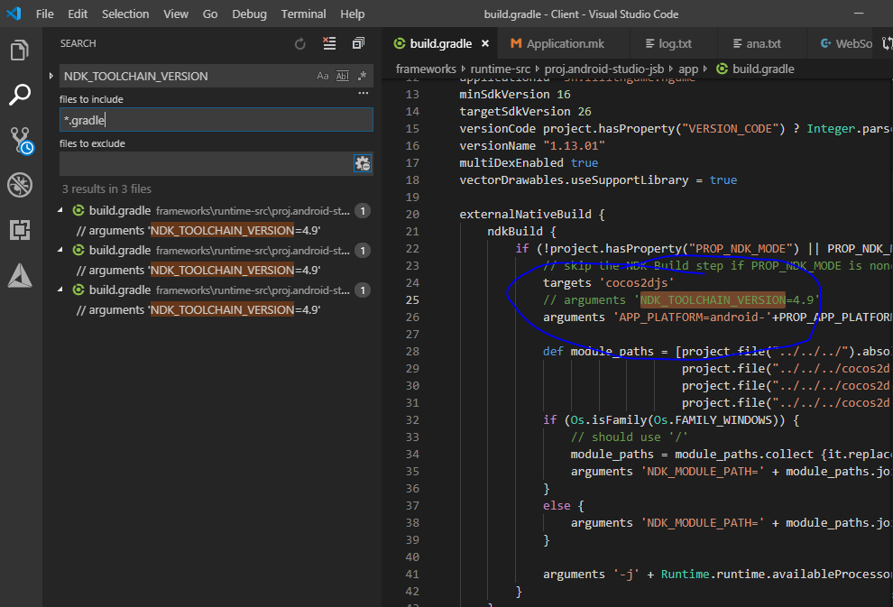
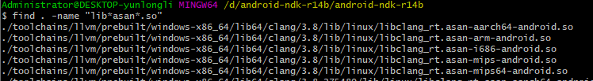
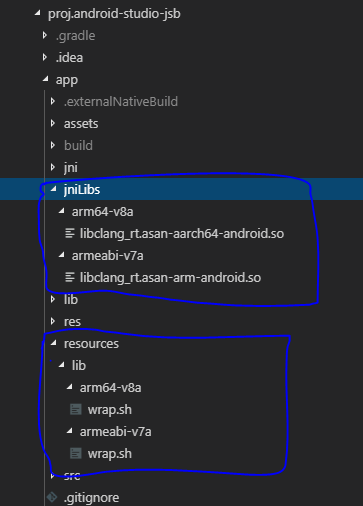
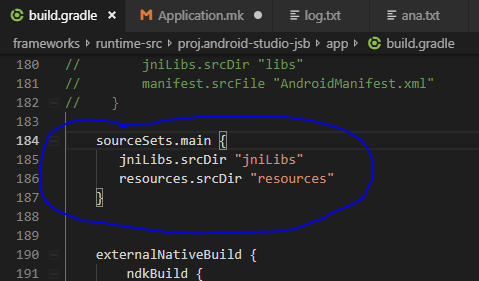
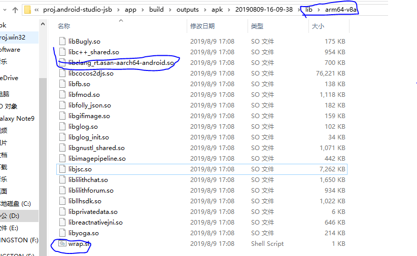
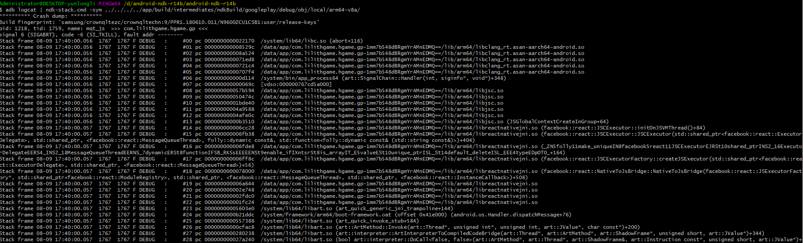

# 使用 Android asan 流程

## 步骤1： 使用 clang

> 由于 gcc4.9 使用 asan 时，链接 libcocos2djs.so 找不到部分符号， 且链接时间长。 需要改用 clang 编译。 

**升级 android ndk 到 r14b**

File > Project Structure > Android NDK location: 



**注释 gradle 中 `NDK_TOOLCHAIN_VERSION` 配置**




## 步骤2: 配置 mk 文件

参考 https://developer.android.com/ndk/guides/asan#building

在 Application.mk 中修改

```mk
APP_STL :=  c++_shared


APP_CFLAGS := -fsanitize=address -fno-omit-frame-pointer

# Uncomment this line to compile to armeabi-v7a, your application will run faster but support less devices
#APP_ABI := armeabi-v7a

APP_CPPFLAGS := -frtti -DCC_ENABLE_CHIPMUNK_INTEGRATION=0 -std=c++11 -fsigned-char -DNATIVE_JSB=1  -fsanitize=address -fno-omit-frame-pointer
APP_LDFLAGS := -latomic -fsanitize=address

```

在各个独立的 Android.mk 中
添加 
```mk
LOCAL_ARM_MODE := arm
```

## 步骤3： 配置 asan.so 和 wrap.sh

程序运行时会依赖 asan.so，虽然新版本的系统都有提供， 但不一定和编译使用的版本一致。 所以需要把编译使用到的 asan.so 拷贝到项目中。 

文件位于 ndk 中



在项目的 app/ 目录 创建子目录 jniLibs/ 和 resources/ 

**拷贝 wrap.sh (可从 https://developer.android.com/ndk/guides/asan#running 获取) 和 asan.so 到相应的目录**

> 这里需要注意: wrap.sh 应该保存为 unix 风格的 EOL 


拷贝后结构如下




**在 build.gradle 中增加 配置**



> 这里配置的两个目录和前面新建的目录需要保持一致。 


## 步骤4： 使用64位编译

修改 gradle.properties 中的

```gradle
PROP_APP_ABI=arm64-v8a
```

> 如果在64位系统中使用 `armeabi-v7a`， 运行时会报错。 可直接运行64位版本。 

## 步骤5： 验证 apk

生成的 apk 的目录结构可以参考下图。 (将生成的apk后缀改为 .zip 后解压。)



**`wrap.sh` 和 `libclang_rt.asan-$arch-android.so` 应与其他 `so` 处于同一个目录**

# 分析dump信息

在发生crash后， logcat 中的符号信息是不完整的， 需要使用 ndk-stack工具分析数据

参考 https://developer.android.com/ndk/guides/ndk-stack?hl=zh-CN




